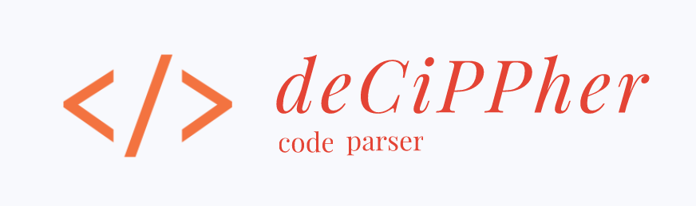
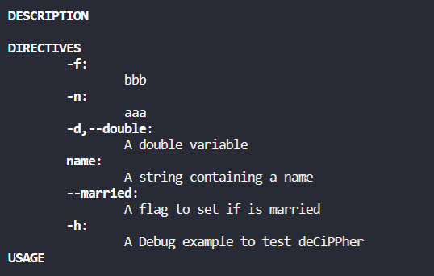

# deCiPPHer: C++ Parser 
A library made to parse arguments passed by the command line.

## The Library

This library has the purpose of this library is to provide a C++ command line parser. There are two classes of objects in this library, options and flags.

### Options
These are variables which receive values to override a local variable content. These variables require an argument. The example below set the option -n or --num_of_threads which will store the value passed in command line to local variable (int) number_of_threads.

``` c++
    /*...*/

    // variable containign number of threads to be used
    int number_of_threads = 0;

    /*...*/

    deCiPPher parser(true);

    // the arguments of the macro are Parser Object, Directives to Call, Description, Local Variable, Num of Args*, If it is required
    DCPP_ADD_OPTION(parser,"-n,--num_of_threads", "Variable storing number of threads", number_of_threads, 1, false); 

    //Num of Args*: Only 1 accepted as num of args currently 
    // ...

```

### Flags
These are boolean variables which purpose is to provide an specific behaviour whenever this flag is passed on command line. The behaviour of a flag is always changing the value from false to true. The example below set a flag to determine if the image of an example should be saved on disk whenever the flag -s or --save is called.

``` c++
    // ...

    bool save = false;

    // ...

    deCiPPher parser(true);

    DCPP_ADD_FLAG(parser, "-s,--saved", "A flag to determine if output image is saved on disk", save);

    // ...

    if(save){
        // Here is the behavior to save the image
    }
```

### Help

The help flag is a special flag which requires no local variable. When calling the help flag, a menu containing all the options and flag defined in the parser. An example below shows the result of the help flag.



The help flag will print the description (if provided on the parser constructor), the directives (options and flags) it contains and the usage (if provided on the parser constructor).

## Usage

The directives definition should follow the call of single dash (-) for single character directive (*e.g.* -A) and double dash (--) for multiple character directive (*e.g.* --Append), although it's not required.

#### Assignment

The assingment on command line can either be with a space between the called directive, or with an = sign (without spaces between).

```bash
    ./example -n 10 --address=127.0.0.1
```

#### Directive Concatenation

Single-dashed directives can be concatenated on a single dash, and if they represent options, their values can be passed in the respective order they are called.

```bash
    ./example -ndsf 10 3.1415 deCiPPher
```

In the example above -n represents an integer variable, -d represents a float/double variable, -s represents a string variable, and -f represents a flag variable (explaining why there are only 3 arguments past the directives).

## Build

The library is built using CMake, and using the following commands on the cloned repository should build and compile the library.

```bash
    mkdir build && cd build
    cmake ..
    make -j 4
```

To use the library you should use the ouput of the building process (**.a** or **.so** for static | shared library on Unix, and **.lib** for Windows users).

## Suggetions and Colaboration

Suggestions and colaborations are welcome and can be submitted with a new Issue or a merge request.